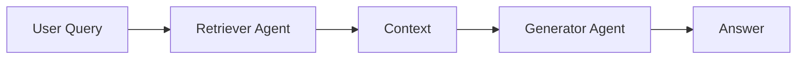
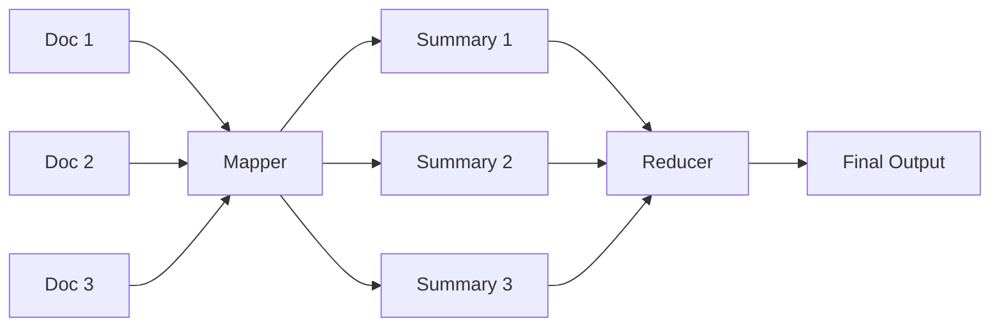
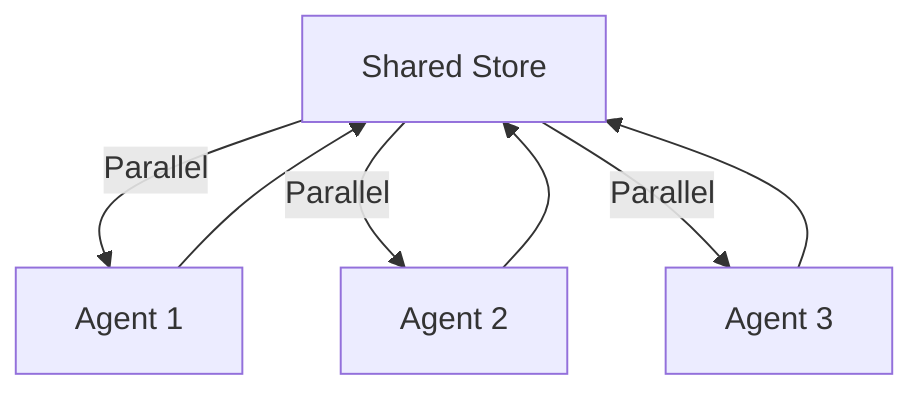
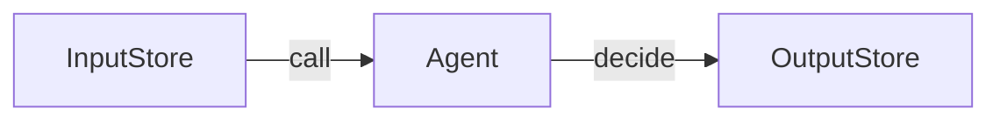
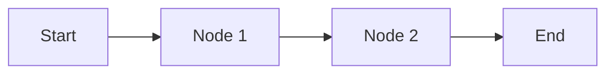

# agentflow-python

**agentflow-python** is a minimalist, async-first Python framework for building, orchestrating, and managing AI agents and workflows. It is inspired by the Rust [agentflow](https://<_>) crate, created by Stephen Ezekwem (stephen.ezekwem@gmail.com), and brings its composable, language-agnostic patterns to Python.

The core library is named `agentflow` and is located in the `agentflow-python/agentflow/` directory. Example scripts are in `agentflow-python/examples/`. The package is not yet published to PyPI, but can be used directly from source.

---

## 📐 Architecture Overview

```mermaid
flowchart TD
    subgraph AgentFlow    Python
        A1[Agent]
        A2[Agent]
        A3[Agent]
        WF[Workflow/Flow Engine]
        STORE[Shared Store (dict)]
    end
    User((User))
    User -- API/CLI --> WF
    WF -- manages --> A1
    WF -- manages --> A2
    WF -- manages --> A3
    A1 -- reads/writes --> STORE
    A2 -- reads/writes --> STORE
    A3 -- reads/writes --> STORE
```

- **Agents**: Specialized async units (LLM, RAG, tool-calling, etc.) that process tasks.
- **Workflow/Flow Engine**: Chains agents into flexible, configurable pipelines with conditional routing.
- **Shared Store**: Central, thread-safe data structure (Python `dict`) for passing state/results between agents.

---

## 🚀 Quickstart

### 1. Install

Clone this repo and install dependencies for examples:

```bash
pip install openai google-generativeai
```

### 2. Use in Your Project

Copy the `agentflow-python/agentflow/` directory into your project, or install as a package if published.

> **Important:** To run example scripts that import `agentflow` correctly, run them as modules from the project root directory (`agentflow-python/`):

```bash
python -m examples.async_agent
```

Alternatively, you can set the `PYTHONPATH` environment variable to the project root before running scripts directly:

```bash
PYTHONPATH=$(pwd) python examples/async_agent.py
```

You can also install the package in editable mode to make it available globally:

```bash
pip install -e .
```

#### Minimal Agent Example

```python
import asyncio
from agentflow import Agent, create_node

async def hello_agent(store):
    name = store.get("name", "stranger")
    store["greeting"] = f"Hello, {name}!"
    return store

async def main():
    agent = Agent(create_node(hello_agent))
    result = await agent.decide({"name": "Alice"})
    print(result["greeting"])

if __name__ == "__main__":
    asyncio.run(main())
```

#### Workflow Example

```python
import asyncio
from agentflow import Workflow, create_node

async def step1(store):
    store["step1"] = "Research done"
    store["action"] = "default"
    return store

async def step2(store):
    store["step2"] = "Code generated"
    store["action"] = "default"
    return store

async def main():
    wf = Workflow()
    wf.add_step("step1", create_node(step1))
    wf.add_step("step2", create_node(step2))
    wf.connect("step1", "step2")
    result = await wf.run({})
    print(result)

if __name__ == "__main__":
    asyncio.run(main())
```

---

## 🧩 Supported Patterns

- **Agent**: Autonomous async decision-making unit.
- **Workflow/Flow**: Chain of agents with conditional routing and branching.
- **RAG**: Retrieval-Augmented Generation (retriever + generator).
- **MapReduce**: Batch map and reduce over data.
- **MultiAgent**: Parallel or coordinated agent execution.
- **StructuredOutput**: Enforce/validate output schemas.

---

## 🛠️ Running the Examples

All examples are located in `agentflow-python/examples/`.  
**You must set your API keys and install dependencies before running any example.**

### 1. Set your API keys (for LLMs):

```bash
export OPENAI_API_KEY=sk-...
export GEMINI_API_KEY=...
```

### 2. Install dependencies:

```bash
pip install openai google-generativeai
```

### 3. Run the examples

**From the project root (`agentflow-python/`), run each example as a module:**

#### Async Agent Example

```bash
python -m examples.async_agent
```

#### Orchestrator Multi-Agent (HITL) Example

```bash
python -m examples.orchestrator_multi_agent
```

#### Structured Output Example

```bash
python -m examples.structured_output
```

**Alternatively, you can run any example directly by setting the `PYTHONPATH`:**

```bash
PYTHONPATH=$(pwd) python examples/async_agent.py
```

Replace `async_agent.py` with the desired example script.

---

**Example summary:**

- `async_agent.py` – Run two agents concurrently (OpenAI and Gemini).
- `orchestrator_multi_agent.py` – Human-in-the-loop multi-step orchestration.
- `structured_output.py` – Compose a pipeline with structured output.

See the code in `agentflow-python/examples/` for more details.

---

## 🗂️ Example: RAG Pattern



- **Retriever**: Uses an LLM or search API to fetch context for a query.
- **Generator**: Uses an LLM to generate an answer based on the context.

---

## 🗂️ Example: MapReduce Pattern



- **Mapper**: Summarizes each document.
- **Reducer**: Aggregates all summaries.

---

## 🗂️ Example: MultiAgent Pattern



- All agents operate in parallel, reading/writing to the shared store.

---

## 📖 Philosophy

- **Composable**: Build complex systems from simple, reusable async parts.
- **Async-first**: Designed for async/await and concurrent execution.
- **Language-agnostic**: Patterns can be ported to Rust, TypeScript, etc.
- **Minimalist**: Focus on core abstractions, not vendor lock-in.

---

## 📦 References

- See  AgentFlow   -python AgentFlow   /examples/` for usage.
- See  AgentFlow   /` for core abstractions and patterns.

---

**Happy agentic building!**
# agentflow-python

agentflow-python is a minimalist, async-first Python framework for building, orchestrating, and managing AI agents and workflows. Inspired by the Rust crate.

---

## Features

- **Agent**: Autonomous async decision-making unit with retry logic.
- **Workflow**: Chain of agents with conditional routing and branching.
- **MultiAgent**: Parallel or coordinated agent execution.
- **RAG**: Retrieval-Augmented Generation (retriever + generator).
- **MapReduce**: Batch map and reduce over data.
- **Composable**: Build complex systems from simple, reusable async parts.
- **Async-first**: Designed for async/await and concurrent execution.

---

## Installation

This package is not yet published to PyPI. To use it, clone the repository and install dependencies:

```bash
pip install openai google-generativeai
```

You can install the package in editable mode for development:

```bash
pip install -e .
```

---

## Quickstart Example

```python
from agentflow import Agent, create_node

async def hello_node(store):
    store["greeting"] = f"Hello, {store.get('name', 'stranger')}!"
    return store

agent = Agent(create_node(hello_node), max_retries=2, wait_millis=100)
result = await agent.decide({"name": "Alice"})
print(result["greeting"])
```

---

## Diagrams

### Agent Pattern



### Workflow Pattern



---

## License

MIT OR Apache-2.0
